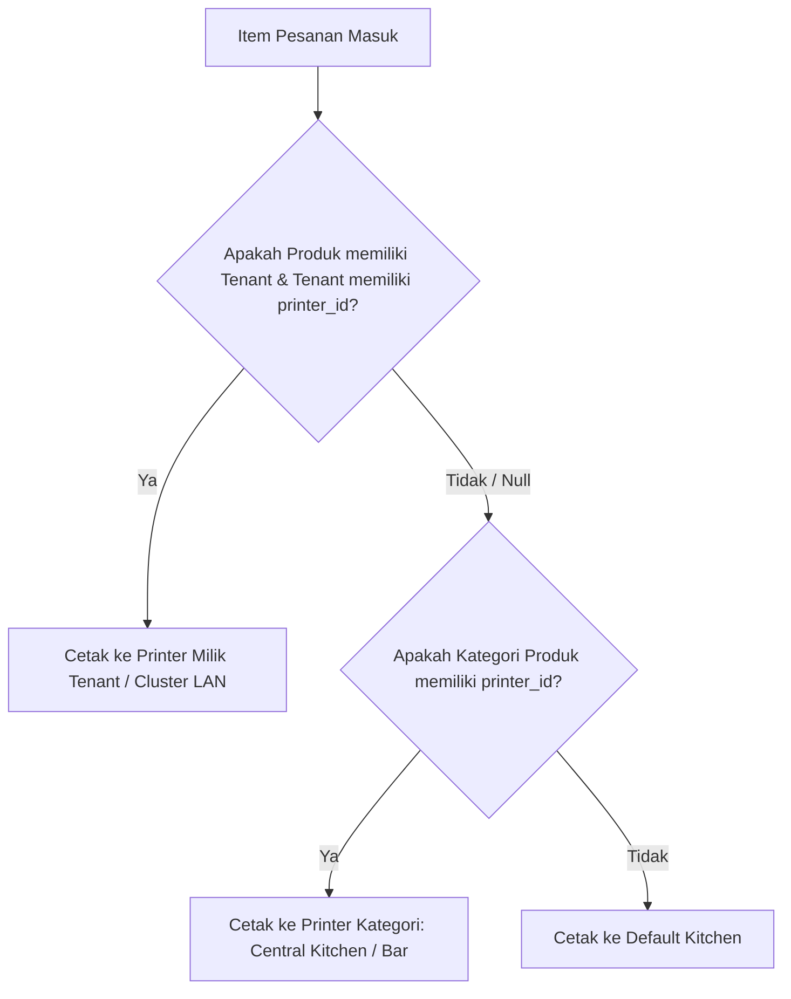

# Rencana Implementasi: Peran Waiter (Order Meja Tablet) & Smart Multi-Printer Routing (Tenant vs Central Kitchen/Bar)

Dokumen ini memuat rencana implementasi terpadu untuk:
1. **Peran Waiter pada POS Mobile (Tablet):** Waiter mencatat pesanan keliling meja berstatus **HOLD**, tanpa akses pembayaran kasir.
2. **Pelekatan `printer_id` pada Tenant:** Memungkinkan 1 printer LAN melayani 3-5 tenant (cluster), dengan **Smart Hierarchical Routing** yang **100% aman dan tidak mempengaruhi kafe yang menggunakan Central Kitchen & Bar**.

---

## User Review Required

> [!IMPORTANT]
> **Jaminan Keamanan untuk Kafe dengan Central Kitchen & Bar:**
> * Kolom `printer_id` pada tabel `tenants` bersifat **`nullable`** (opsional).
> * **Hierarki Pencarian Printer (Smart Fallback):**
>   $$\text{Tenant Printer (jika ada)} \longrightarrow \text{Kategori Printer (Dapur/Bar)} \longrightarrow \text{Default Kitchen}$$
> * **Pada Kafe Biasa (Central Kitchen & Bar):** Produk tidak memiliki tenant (`tenant_id = null`) atau tenant tidak memilih printer khusus. Sistem akan langsung menggunakan **Kategori Printer** (Makanan $\to$ Kitchen, Minuman $\to$ Bar).
> * **Hasil:** Kafe central kitchen & bar berjalan 100% normal seperti sedia kala, tanpa ada perubahan alur kerja.

---

## Arsitektur Smart Multi-Printer Routing



### Simulasi Skenario di Lapangan:

1. **Kasus Kafe Biasa (Central Kitchen & Bar):**
   * *Nasi Goreng* (Kategori: Makanan $\to$ Printer Kitchen) $\implies$ Dicetak di **Printer Kitchen**.
   * *Kopi Latte* (Kategori: Minuman $\to$ Printer Bar) $\implies$ Dicetak di **Printer Bar**.
   * *(Tenant kosong/null $\to$ Otomatis ikut kategori, aman 100%)*

2. **Kasus Food Court / Multi-Tenant (Cluster LAN Printer):**
   * *Sate Madura* (Tenant: Sate Cak Har $\to$ Printer: Cluster Barat LAN) $\implies$ Dicetak di **Cluster Barat**.
   * *Bakso Urat* (Tenant: Bakso Mas Bejo $\to$ Printer: Cluster Barat LAN) $\implies$ Dicetak di **Cluster Barat**.
   * *Es Teh Manis* (Tenant: Minuman Toko $\to$ Kategori: Minuman $\to$ Printer: Bar) $\implies$ Dicetak di **Printer Bar**.

---

## Rincian Perubahan Komponen

### 1. Database & Backend: Laravel (`d:\laravel\rimspos`)

#### [NEW] [Migration: Add printer_id to tenants table]
* Menambahkan foreign key nullable:
  ```php
  Schema::table('tenants', function (Blueprint $table) {
      $table->foreignId('printer_id')->nullable()->after('store_id')->constrained('store_printers')->nullOnDelete();
  });
  ```

#### [MODIFY] [Tenant.php](file:///d:/laravel/rimspos/app/Models/Tenant.php)
* Tambahkan `printer_id` ke `$fillable`.
* Tambahkan relasi:
  ```php
  public function printer()
  {
      return $this->belongsTo(StorePrinter::class, 'printer_id');
  }
  ```

#### [MODIFY] [RoleMaster.php](file:///d:/laravel/rimspos/app/Models/RoleMaster.php) & Migration
* Menambahkan `'WAITER'` pada ENUM `role_type` di tabel `role_master`.

#### [MODIFY] Form Kelola Tenant (Web Admin)
* File: `resources/views/tenants/` (create & edit).
* Tambahkan dropdown: **"Target Printer Stasiun / Dapur (Opsional)"** yang mengambil daftar printer dari `store_printers` toko aktif.

#### [MODIFY] [PosController.php](file:///d:/laravel/rimspos/app/Http/Controllers/PosController.php)
* **Logika Pemfilteran Stasiun Cetak (`apiReceipt`):**
  Perbarui pendeteksian kode stasiun per item pesanan:
  ```php
  $tenant = $item->product?->tenant ?: $item->variant?->product?->tenant;
  $cat    = $item->product?->category ?: $item->variant?->product?->category;

  // Prioritas 1: Printer Tenant, Prioritas 2: Printer Kategori, Prioritas 3: Default 'kitchen'
  $stationCode = $tenant?->printer?->code ?: ($cat?->printer?->code ?: ($cat?->station ?: 'kitchen'));
  ```
* **Format Judul Slip Tenant pada Struk Checklist (`EscPosReceiptService.php`):**
  Jika stasiun yang dicetak merupakan printer tenant/cluster, tiket pesanan menambahkan baris penanda tenant:
  `[ TENANT: SATE CAK HAR ]`
* **Validasi Keamanan Waiter di `PosController@checkout`:**
  Jika `Auth::user()->role_type === 'WAITER'`:
  * Wajib `payment_method === 'hold'`. Tolak pembayaran langsung dengan HTTP 403.
  * Simpan identitas waiter di data transaksi `sale`.

---

### 2. Frontend Mobile: Flutter (`d:\learnflutter\rimspos_mobile`)

#### [MODIFY] [user.dart](file:///d:/learnflutter/rimspos_mobile/lib/models/user.dart)
* Tambahkan getter:
  ```dart
  bool get isWaiter => roleType == 'WAITER';
  ```

#### [MODIFY] [pos_screen.dart](file:///d:/learnflutter/rimspos_mobile/lib/screens/pos/pos_screen.dart)
1. **Bypass Shift Kasir:**
   * Jika `user.isWaiter`, lewati popup `_showOpenCashierDialog()`.
2. **Transformasi Tombol Aksi Keranjang:**
   * Jika `user.isWaiter`:
     * Tombol `[Checkout / Bayar]` **DIHILANGKAN**.
     * Tombol utama menjadi tombol lebar penuh:  
       **`[ 🚀 Kirim Pesanan Meja ]`** (Icon send, warna hijau emerald).
3. **Validasi Meja Cepat:**
   * Jika meja belum diisi saat menekan *Kirim Pesanan Meja*, tampilkan dialog input nomor meja.
4. **Alur Distribusi Cetak Otomatis:**
   * Saat order tersimpan sebagai HOLD:
     * Jika toko mengaktifkan Multi-Printer: panggil pencetakan background ke printer stasiun yang relevan (Printer Cluster LAN / Bar / Kitchen).
5. **Akses Open Bills (Pesanan Meja Aktif):**
   * Waiter tetap bisa melihat daftar meja yang sedang terisi dan membuka meja tersebut untuk menambah menu (*add-on order*).
6. **Proteksi Menu Drawer:**
   * Sembunyikan *Tutup Kasir*, *Petty Cash*, dan *Laporan Keuangan* untuk akun Waiter.

---

## Verification Plan

### Automated Tests
1. **Test Routing Printer Central Kitchen vs Tenant:**
   ```powershell
   php artisan test --filter=StationPrinterRoutingTest
   ```
   * Memastikan produk tanpa tenant mencetak ke printer kategorinya (Central Kitchen/Bar).
   * Memastikan produk dengan tenant mencetak ke printer tenant jika `printer_id` diisi.
2. **Test Waiter Authorization:**
   ```powershell
   php artisan test --filter=PosWaiterCheckoutTest
   ```
   * Waiter berhasil menyimpan order meja `hold`.
   * Waiter gagal jika mencoba bayar `cash`.

### Manual Verification
1. **Verifikasi Kafe Central Kitchen & Bar:**
   * Buka toko tipe FnB biasa (tanpa tenant).
   * Pesan 1 Makanan dan 1 Minuman $\rightarrow$ pastikan Makanan masuk ke Printer Kitchen dan Minuman masuk ke Printer Bar seperti biasa.
2. **Verifikasi Cluster Tenant:**
   * Setting Tenant A dan Tenant B memilih printer "Cluster Barat".
   * Buat pesanan menu Tenant A dan Tenant B $\rightarrow$ slip tercetak bersamaan di printer Cluster Barat.
3. **Verifikasi Tablet Waiter:**
   * Login sebagai user role Waiter.
   * Pastikan tidak ada popup buka shift kasir.
   * Pilih menu $\rightarrow$ tombol bawah hanya tertulis **"Kirim Pesanan Meja"**.
   * Tekan kirim $\rightarrow$ berhasil simpan sebagai HOLD.
   * Buka POS Kasir Utama $\rightarrow$ meja yang diinput waiter muncul di daftar pesanan aktif dan siap dibayar oleh kasir.
