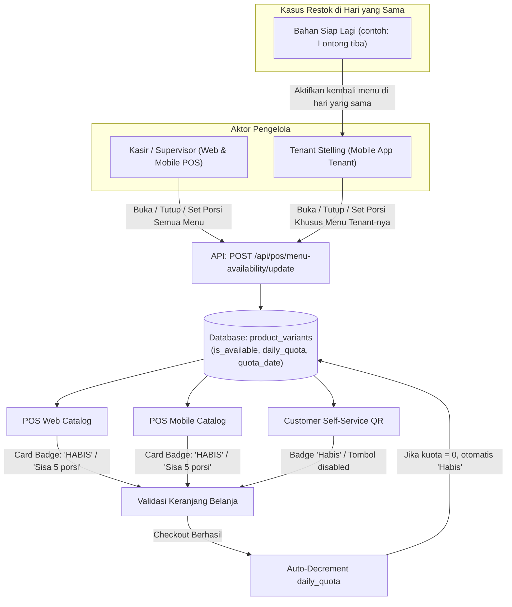

# Implementation Plan - FnB Menu Availability & Daily Portion Quota ("86 System")

Fitur ini dirancang khusus untuk bisnis **F&B (Food & Beverage)**, pujasera/food court, dan kafe/restoran di mana menu/varian sering kali **tidak menggunakan pelacakan stok inventori bahan baku secara kaku (`track_stock = false`)**, namun dapur atau stelling tenant perlu mengontrol ketersediaan menu secara *real-time*:
1. **Toggle Available / Sold Out (Sistem 86)**: Menyatakan menu habis (misal: "Sate Ayam habis") sehingga kasir web, kasir mobile, dan pemesanan mandiri QR (*Customer Self-Service*) tidak dapat menjualnya.
2. **Batas Porsi Harian / Sisa Porsi Tersedia**: Tenant menginformasikan ke kasir "Sate tinggal 5 porsi lagi". Kasir atau supervisor memasukkan kuota 5 porsi, dan setiap transaksi penjualan akan otomatis memotong sisa porsi tersebut hingga otomatis menjadi "Habis (0)" saat kuota habis.

---

## User Review & Clarifications Confirmed

> [!NOTE]
> **Keputusan & Kebutuhan Spesifik User**:
> 1. **Buka-Tutup Menu Fleksibel di Hari yang Sama (Real-Time Re-activation)**:
>    - Menu/varian yang sempat ditutup penjualannya (misal: Sate ditutup karena kehabisan lontong) **bisa diaktifkan kembali kapan saja di hari yang sama** begitu bahan/stok tersedia kembali (misal: 3 jam kemudian lontong siap, kasir/tenant dapat langsung mengaktifkan kembali dengan porsi baru atau tanpa batas).
>    - Sistem mendukung pergantian status `Tersedia -> Habis -> Tersedia` secara berulang tanpa batasan waktu dalam satu hari kerja.
> 2. **Hak Akses Khusus Akun Tenant di Mobile App**:
>    - Selain kasir utama, jika produk terafiliasi dengan Tenant/Stelling (`products.tenant_id`), pengguna yang login sebagai **Tenant** di aplikasi mobile memiliki menu **"Ketersediaan Menu Saya"** pada `TenantDrawer`.
>    - Tenant dapat secara mandiri membuka/menutup penjualan menu mereka sendiri atau mengatur sisa porsi (misal sate tinggal 5 porsi) langsung dari HP mereka, tanpa harus selalu meminta kasir utama.
>    - Backend memvalidasi otorisasi: akun tenant hanya diizinkan mengubah status produk yang berada di bawah `tenant_id` miliknya.

---

## Arsitektur & Alur Kerja (Workflow)

---

## Proposed Changes

### 1. Database & Migrations (Laravel Web)

#### [NEW] [migration_add_availability_and_quota_to_product_variants](file:///d:/laravel/rimspos/database/migrations/2026_09_16_000000_add_availability_and_quota_to_product_variants.php)
- Menambahkan kolom ke tabel `product_variants`:
  - `is_available` (`boolean`, default `true`, index) -> menandakan status ketersediaan menu.
  - `daily_quota` (`integer`, nullable, default `null`) -> sisa porsi siap jual (`null` = *unlimited*).
  - `quota_date` (`date`, nullable, default `null`) -> tanggal kuota porsi ditetapkan.

---

### 2. Backend Models & Services (Laravel Web)

#### [MODIFY] [ProductVariant.php](file:///d:/laravel/rimspos/app/Models/ProductVariant.php)
- Menambahkan `$fillable`: `'is_available'`, `'daily_quota'`, `'quota_date'`.
- Menambahkan `$casts`: `'is_available' => 'boolean'`, `'daily_quota' => 'integer'`, `'quota_date' => 'date'`.
- Menambahkan accessor & helper methods:
  - `getEffectiveStockAttribute()`:
    - Jika `!$this->is_available`: return `0`.
    - Jika `!$this->track_stock`: return `$this->daily_quota !== null ? max(0, $this->daily_quota) : 999999`.
    - Jika `$this->track_stock`: return `stok_store`.
  - `decrementDailyQuota(int $qty)`:
    - Jika `$this->daily_quota !== null`: kurangi kuota sebanyak `$qty`. Jika `<= 0`, set `$this->daily_quota = 0` dan `$this->is_available = false`.

#### [MODIFY] [PosController.php](file:///d:/laravel/rimspos/app/Http/Controllers/PosController.php)
- **`findProduct(Request $request)`**:
  - Sertakan `is_available`, `daily_quota`, dan gunakan `effective_stock` sebagai nilai `stok` yang dikembalikan ke client (Web & Mobile).
- **Endpoint Baru: `apiGetMenuAvailability(Request $request)`**:
  - `GET /api/pos/menu-availability?store_id=X&tenant_id=Y&q=sate`
  - Jika user yang login adalah Tenant (`auth()->user()->tenant_id`), otomatis difilter hanya menu milik tenant tersebut.
  - Mengambil daftar produk & varian dengan status ketersediaan, porsi sisa, kategori, dan tenant untuk ditampilkan di modal kasir / sheet mobile.
- **Endpoint Baru: `apiUpdateMenuAvailability(Request $request)`**:
  - `POST /api/pos/menu-availability/update`
  - Menerima `variant_id` (atau `product_id` untuk update semua varian sekaligus), `is_available` (bool), dan `daily_quota` (int|null).
  - **Otorisasi Tenant**: Jika user login sebagai akun Tenant, sistem memvalidasi bahwa produk/varian yang diubah benar milik `tenant_id` user tersebut (mencegah tenant A mengubah menu tenant B). Kasir/Supervisor toko memiliki akses penuh untuk seluruh menu toko.
  - **Re-activation Real-Time**: Status dapat diubah bolak-balik kapan saja (misal: habis pukul 12.00, lalu diaktifkan kembali pukul 15.00 dengan kuota baru atau tanpa batas).
- **Pengurangan Kuota saat Checkout**:
  - Di `checkout()` (Web POS) dan `apiCheckout()` (Mobile POS):
    - Pada perulangan item penjualan: jika varian memiliki `daily_quota !== null`, panggil `$variant->decrementDailyQuota($baseDeductQty)`.

#### [MODIFY] [CustomerSelfServiceController.php](file:///d:/laravel/rimspos/app/Http/Controllers/CustomerSelfServiceController.php)
- Menampilkan status habis/sisa porsi pada portal QR Self-Service.
- Memotong `daily_quota` saat pesanan self-service masuk.

#### [MODIFY] [api.php](file:///d:/laravel/rimspos/routes/api.php) & [web.php](file:///d:/laravel/rimspos/routes/web.php)
- Mendaftarkan rute:
  - `GET /api/pos/menu-availability`
  - `POST /api/pos/menu-availability/update`
  - `POST /api/pos/menu-availability/reset-all` (opsional untuk reset harian seluruh tenant/toko)

---

### 3. Web UI (Laravel Blade + JavaScript)

#### [MODIFY] [resources/views/pos/index.blade.php](file:///d:/laravel/rimspos/resources/views/pos/index.blade.php) & [pos.js](file:///d:/laravel/rimspos/resources/js/pos/pos.js)
- Menambahkan tombol aksi di bar POS: **"Ketersediaan Menu (86)"**.
- Modal Interaktif Ketersediaan Menu:
  - Filter pencarian cepat nama menu / varian & filter tenant (jika mode FnB).
  - Status toggle switch (Tersedia / Habis).
  - Input sisa porsi kuota harian (atau tombol cepat: `Tanpa Batas`, `5`, `10`, `20`, `Habis (0)`).
- Penanganan di Keranjang Belanja Web:
  - Mencegah input produk jika status `is_available == false` atau `stok <= 0`.
  - Tampilkan peringatan SweetAlert: *"Menu ini sedang habis (Sold Out)"* atau *"Sisa kuota porsi tidak mencukupi"*.

#### [MODIFY] [resources/views/produk/index.blade.php](file:///d:/laravel/rimspos/resources/views/produk/index.blade.php)
- Untuk Store Supervisor/Admin: Menambahkan tombol & modal yang sama pada halaman Manajemen Produk untuk audit stok ketersediaan FnB harian.

---

### 4. Mobile App (Flutter)

#### [MODIFY] [product_variant.dart](file:///d:/learnflutter/rimspos_mobile/lib/models/product_variant.dart)
- Menambahkan field:
  - `final bool isAvailable;`
  - `final int? dailyQuota;`
- Menambahkan getter helper:
  - `bool get isSoldOut => !isAvailable || (trackStock ? stok <= 0 : (dailyQuota != null && dailyQuota! <= 0));`
  - `bool get isLimitedQuota => !trackStock && dailyQuota != null && dailyQuota! > 0;`

#### [NEW] [menu_availability_sheet.dart](file:///d:/learnflutter/rimspos_mobile/lib/screens/pos/menu_availability_sheet.dart)
- Bottom Sheet / Dialog interaktif untuk Kasir & Supervisor di Mobile:
  - Search bar menu.
  - Filter tenant & kategori.
  - Setiap kartu menu menampilkan switch `Tersedia / Habis`.
  - Tombol aksi cepat: `+5 Porsi`, `+10 Porsi`, `Habiskan (0)`, `Reset Tanpa Batas`.
  - Input kustom angka porsi (misal input manual: `5` porsi).
  - Tombol simpan yang langsung memperbarui backend dan memperbarui state katalog POS secara lokal tanpa reload total.

#### [MODIFY] [pos_service.dart](file:///d:/learnflutter/rimspos_mobile/lib/services/pos_service.dart)
- Menambahkan fungsi:
  - `getMenuAvailability({required String token, required int storeId, int? tenantId, String? search})`
  - `updateMenuAvailability({required String token, required int storeId, required int variantId, required bool isAvailable, int? dailyQuota})`

#### [MODIFY] [pos_screen.dart](file:///d:/learnflutter/rimspos_mobile/lib/screens/pos/pos_screen.dart)
- **Tampilan Kartu Produk (`_buildProductCard`)**:
  - Jika `prod.isSoldOut`: Tampilkan overlay gelap tipis dengan badge merah menyala **"HABIS / SOLD OUT"**.
  - Jika `prod.isLimitedQuota`: Tampilkan badge oranye **"Sisa ${prod.dailyQuota} Porsi"**.
  - Jika item habis, tap pada kartu menampilkan SnackBar: *"Menu ${prod.name} sedang habis / sold out"*.
- **Validasi Keranjang (`_addOrIncrement`)**:
  - Jika `prod.dailyQuota != null`: periksa apakah `qtyDalamCart + 1 > prod.dailyQuota`. Jika melebihi, tampilkan SnackBar: *"Porsi ${prod.name} hanya tersisa ${prod.dailyQuota} porsi"*.
- **Aksi Cepat di AppBar**:
  - Tambahkan icon menu ketersediaan (misal: `Icons.restaurant_menu` / `Icons.do_not_disturb_on_outlined` dengan badge jika ada menu yang habis) untuk membuka `MenuAvailabilitySheet`.

#### [MODIFY] [tenant_drawer.dart](file:///d:/learnflutter/rimspos_mobile/lib/widgets/tenant_drawer.dart) & [tenant_orders_screen.dart](file:///d:/learnflutter/rimspos_mobile/lib/screens/tenant/tenant_orders_screen.dart)
- Menambahkan menu **"Ketersediaan Menu Saya"** di drawer tenant:
  - Membuka `MenuAvailabilitySheet` otomatis terfilter hanya untuk menu milik tenant yang sedang login.
  - Tenant dapur / stelling dapat langsung mengabarkan atau menandai menunya habis / sisa 5 porsi tanpa harus meminta bantuan kasir.

---

## Verification Plan

### Automated Tests
- **Backend Feature Test (`MenuAvailabilityTest.php`)**:
  - `test_can_fetch_menu_availability_list()`: Memastikan daftar varian dan status ketersediaannya terambil dengan benar.
  - `test_can_toggle_availability_and_set_daily_quota()`: Memastikan endpoint update menyimpan status `is_available` dan `daily_quota`.
  - `test_checkout_auto_decrements_daily_quota()`: Memastikan saat checkout menu non-track stock dengan kuota 5 terjual 2, kuota tersisa 3.
  - `test_quota_reaching_zero_marks_as_sold_out()`: Memastikan saat porsi habis (0), item otomatis menjadi `is_available = false` dan `stok = 0`.
  - `test_sold_out_product_cannot_be_ordered()`: Memastikan order ditolak jika item telah habis.

### Manual Verification
1. **Web POS & Web Supervisor**:
   - Buka Web POS atau Menu Produk -> Klik "Ketersediaan Menu (86)".
   - Pilih menu (misal "Sate Ayam"), set kuota menjadi `5 porsi`.
   - Lakukan transaksi 2 porsi Sate Ayam di POS -> Pastikan sisa kuota di POS berkurang menjadi `3 porsi`.
   - Buka modal lagi, klik tombol "Tandai Habis" -> Pastikan kartu Sate Ayam di POS berubah menjadi "Habis" dan tidak bisa dimasukkan ke keranjang.
2. **Mobile POS & Tenant Drawer**:
   - Buka aplikasi Mobile POS -> Klik icon "Ketersediaan Menu".
   - Set menu "Es Jeruk" sisa `2 porsi`.
   - Cek katalog POS -> Muncul badge "Sisa 2 Porsi". Masukkan 2 porsi ke keranjang. Saat coba tambah porsi ke-3, muncul SnackBar peringatan kuota tidak cukup.
   - Selesaikan transaksi -> Cek kembali katalog: Es Jeruk otomatis berlabel merah "HABIS".
   - Login sebagai Tenant -> Buka drawer "Ketersediaan Menu Saya" -> Cek update ketersediaan dari sisi tenant.
