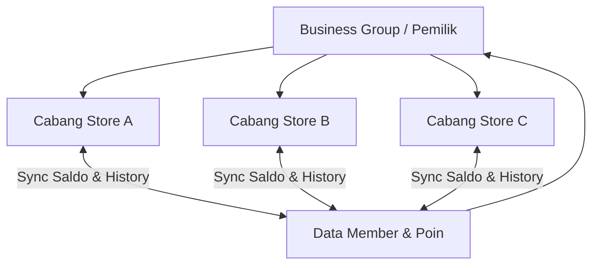

# Product Requirement Document (PRD)
## Fitur: Customer Loyalty Points & Member History (Multi-Branch)

---

## 1. Pendahuluan & Latar Belakang
Dalam bisnis retail dan F&B, retensi pelanggan sangat bergantung pada program loyalitas. Fitur **Customer Loyalty Points** dirancang agar pemilik toko (*Store Owner*) dapat memberikan apresiasi kepada pelanggan setia (*Member*) dalam bentuk poin yang dapat dikumpulkan dari setiap transaksi dan ditukarkan di kemudian hari. 

Fitur ini harus mendukung struktur bisnis **Multi-Cabang (Multi-Branch)**, di mana poin yang dikumpulkan di Cabang A dapat digunakan atau ditukarkan di Cabang B selama cabang-cabang tersebut berada di bawah entitas bisnis/mercant yang sama.

---

## 2. Fitur Utama (Core Features)
1. **Sistem Keanggotaan Terpusat (Centralized Member Database)**:
   - Pelanggan terdaftar sebagai member di bawah entitas bisnis utama (*Merchant/Group*), bukan cabang tunggal.
2. **Pengaturan Poin Fleksibel (Flexible Point Configuration)**:
   - Pengaturan rasio poin default berdasarkan nominal belanja transaksi.
   - Pengaturan poin khusus (*Custom Product Points*) per produk atau varian produk.
3. **Riwayat Mutasi Poin (Point Mutation History)**:
   - Pencatatan mendetail untuk setiap poin yang masuk (*Earned*) atau keluar (*Redeemed*), lengkap dengan cabang asal transaksi.
4. **Dukungan Multi-Cabang (Multi-Branch Support)**:
   - Integrasi saldo poin secara real-time antar cabang di bawah satu pemilik bisnis yang sama.
5. **Penukaran Poin (Point Redemption)**:
   - Poin dapat digunakan sebagai pemotong tagihan (*diskon nominal*) atau ditukarkan dengan produk gratis (*voucher reward*).

---

### 3. Mekanisme Perhitungan Poin

Untuk menghitung perolehan poin secara adil pada bisnis retail dan FnB, sistem menggunakan konsep **Total Belanja Terhitung (Eligible Spend)**. Nominal belanja yang dihitung untuk poin disaring berdasarkan preferensi pengecualian yang di-set di level admin.

### Parameter Input Perhitungan:
- **Subtotal**: Total harga produk sebelum pajak dan biaya tambahan.
- **Diskon**: Potongan harga produk (promo) atau potongan nota (voucher/diskon transaksi).
- **Tax (Pajak PPN/PB1)**: Nilai pajak transaksi.
- **Service Charge (FnB)**: Biaya layanan restoran.
- **Delivery Fee**: Biaya pengiriman kurir.
- **Excluded Categories/Products**: Produk atau kategori yang tidak mendapat poin.

$$\text{Total Belanja Terhitung} = \text{Subtotal} - \text{Diskon} - (\text{Tax}_{\text{jika dikecualikan}}) - (\text{Service Charge}_{\text{jika dikecualikan}}) - (\text{Delivery Fee}_{\text{jika dikecualikan}}) - (\text{Nominal Item Dikecualikan})$$

Sistem menyediakan 3 metode perhitungan poin:

### Metode 1: Nominal Transaksi (Transaction-based Points)
Poin dihitung dari total belanja pelanggan setelah diskon dengan kelipatan nominal tertentu yang diset oleh toko.
* **Pengaturan Toko**: 
  - Kelipatan Belanja (Threshold): Rp 10.000
  - Perolehan Poin (Value): 1 Poin
* **Rumus**:
  $$\text{Poin Diperoleh} = \lfloor \frac{\text{Total Belanja Terhitung}}{\text{Kelipatan Belanja}} \rfloor \times \text{Perolehan Poin}$$
* *Contoh*: Pelanggan FnB belanja Rp 45.500 (Subtotal). Ada Pajak Rp 4.550 dan Service Charge Rp 2.275. Jika Admin mengaktifkan pengecualian Pajak & Service Charge, maka Total Belanja Terhitung adalah Rp 45.500.
  Poin diperoleh: $\lfloor 45.500 / 10.000 \rfloor \times 1 = 4\text{ Poin}$.

### Metode 2: Berdasarkan Produk (Product-Specific Points)
Poin diperoleh berdasarkan jumlah item produk yang dibeli. Setiap produk/varian yang memiliki nilai poin custom akan berkontribusi terhadap total poin. Produk yang tidak di-set nilai poinnya tidak akan memberikan poin.
* **Pengaturan Produk**:
  - Nasi Goreng Spesial: 5 Poin
  - Es Teh Manis: 1 Poin
  - Kerupuk (tidak di-set): 0 Poin
* **Rumus**:
  $$\text{Poin Diperoleh} = \sum (\text{Poin Produk}_i \times \text{Qty}_i)$$
  *(Catatan: Item dengan diskon/promo tetap mendapatkan poin produk kecuali admin mengaktifkan pengecualian item diskon).*

### Metode 3: Hybrid (Gabungan - Nominal Transaksi & Produk)
Merupakan metode gabungan antara Metode 1 dan Metode 2. 
- Produk yang memiliki pengaturan poin khusus (Metode 2) akan dihitung secara spesifik menggunakan poin produknya.
- Sisa nominal belanja dari produk biasa (yang tidak memiliki pengaturan poin khusus) akan dihitung menggunakan rasio nominal belanja (Metode 1).
* **Rumus**:
  $$\text{Poin Diperoleh} = \left( \sum \text{Poin Produk Khusus}_i \times \text{Qty}_i \right) + \lfloor \frac{\text{Total Belanja Produk Biasa Terhitung}}{\text{Kelipatan Belanja}} \rfloor \times \text{Perolehan Poin}$$

---

## 4. Pengaturan Poin di Level Admin (Admin Configuration Panel)

Menu pengaturan poin berada di **Dashboard Web Admin RimsPos** di bawah menu **Add-ons > Loyalty Points Settings**. Di sini, Pemilik Bisnis (*Business Owner*) atau Store Admin yang memiliki hak akses dapat mengatur parameter poin dengan fleksibilitas tinggi.

```
+---------------------------------------------------------------------------------+
| LOYALTY POINTS CONFIGURATION                                                    |
+---------------------------------------------------------------------------------+
| [x] Aktifkan Add-on Loyalty Points                                              |
|                                                                                 |
| Cakupan Pengaturan:  (o) Terpusat (Global)  ( ) Kustom per Cabang               |
|                                                                                 |
| +-----------------------------------------------------------------------------+ |
| |  [1] Earning Rules   |   [2] Redemption Rules   |   [3] Expiration & Bonus  | |
| +-----------------------------------------------------------------------------+ |
| |                                                                             | |
| |  METODE PEROLEHAN POIN                                                      | |
| |  Method: [ Nominal Transaksi     [v] ]                                      | |
| |  Rasio: Setiap belanja kelipatan [ Rp 10.000 ] mendapatkan [ 1 ] Poin       | |
| |                                                                             | |
| |  PENGEQUALIAN (EXCLUSIONS)                                                  | |
| |  [x] Kecualikan Pajak (PPN/PB1)                                             | |
| |  [x] Kecualikan Service Charge (FnB)                                        | |
| |  [x] Kecualikan Biaya Pengiriman (Delivery Fee)                             | |
| |  [x] Kecualikan Produk Diskon/Promo                                         | |
| |  Kecualikan Kategori Produk: [ Rokok, Pulsa & PPOB                  [v] ]   | |
| |                                                                             | |
| +-----------------------------------------------------------------------------+ |
| |                                                                 [ SIMPAN ]  | |
| +-----------------------------------------------------------------------------+ |
+---------------------------------------------------------------------------------+
```

### A. Konfigurasi Umum (General Settings)
1. **Toggle Aktifkan Loyalty Points**: Jika dinonaktifkan, seluruh modul member poin di POS, Self-Service, dan backoffice akan disembunyikan.
2. **Cakupan Pengaturan (Configuration Scope)**:
   - **Terpusat (Global)**: Pengaturan yang dibuat di pusat otomatis berlaku di seluruh cabang bisnis.
   - **Kustom per Cabang (Store-specific Overrides)**: Admin dapat memilih cabang tertentu untuk menggunakan konfigurasi poin yang berbeda (misal: Cabang Bandara memiliki kelipatan belanja atau nilai penukaran poin yang berbeda karena perbedaan margin).

### B. Aturan Perolehan Poin (Earning Rules Tab)
1. **Metode Earning**: Dropdown berisi 3 pilihan: *Nominal Transaksi*, *Spesifik Produk*, atau *Hybrid*.
2. **Kelipatan Belanja & Poin (Earning Ratio)**: Nilai nominal kelipatan belanja dan poin yang didapatkan (hanya aktif untuk metode Nominal dan Hybrid).
3. **Pengecualian Perolehan Poin (Earning Exclusions)**:
   - **Kecualikan Pajak**: Menghindari pemberian poin atas nilai pajak PPN atau PB1 (pajak restoran).
   - **Kecualikan Service Charge**: Menghindari pemberian poin atas biaya layanan restoran (khusus FnB).
   - **Kecualikan Biaya Kirim**: Menghindari pemberian poin atas ongkos kirim pada pesanan delivery.
   - **Kecualikan Produk Diskon/Promo**: Memastikan barang yang sudah didiskon (misal diskon coret atau promo beli 1 gratis 1) tidak menghasilkan poin lagi untuk menjaga profitabilitas.
   - **Kecualikan Kategori Produk**: Dropdown multi-select untuk mengecualikan kategori produk tertentu dari perolehan poin (sangat berguna untuk retail, misal: rokok, susu formula bayi, pulsa/token, atau barang konsinyasi).

### C. Aturan Penukaran Poin (Redemption Rules Tab)
1. **Nilai Tukar Poin (Point Value)**: Nilai nominal Rupiah dari setiap 1 poin yang ditukarkan (Contoh: 1 Poin = Rp 100).
2. **Minimum Poin Untuk Redeem (Min Points to Redeem)**: Jumlah saldo poin minimal yang harus dimiliki member sebelum bisa digunakan (Contoh: Minimal 50 Poin baru bisa digunakan untuk memotong tagihan).
3. **Batas Maksimal Penukaran per Transaksi (Max Redemption Limits)**:
   - **Batas Persentase (%)**: Maksimum persentase dari total tagihan yang boleh dibayar menggunakan poin (Contoh: Maksimal 50% dari total tagihan, sisanya wajib dibayar tunai/non-tunai).
   - **Batas Nominal (Rupiah)**: Maksimum nilai rupiah potongan poin dalam satu transaksi (Contoh: Maksimal Rp 100.000 per transaksi).
4. **Saluran Penukaran yang Diizinkan (Allowed Channels)**:
   - *Kasir POS*: Kasir bisa memasukkan potongan poin langsung dari aplikasi POS.
   - *Self-Service Kiosk*: Pelanggan bisa melakukan scan QR keanggotaan dan menukarkan poin secara mandiri.
   - *Mobile / Web Ordering*: Pelanggan menukarkan poin melalui website/aplikasi pemesanan online.

### D. Pengaturan Masa Berlaku & Bonus (Expiration & Bonus Tab)
1. **Masa Berlaku Poin (Expiration Rules)**:
   - **Selamanya (Never Expire)**: Poin tidak akan pernah hangus.
   - **Durasi Relatif (Relative Duration)**: Poin akan hangus setelah X bulan dari tanggal poin tersebut diperoleh (Contoh: 12 bulan setelah diperoleh).
   - **Tanggal Hangus Tetap (Fixed Date Expiration)**: Semua poin akan hangus serentak pada tanggal tertentu setiap tahun (Contoh: Setiap 31 Desember pukul 23:59).
2. **Insentif Pendaftaran Baru (Welcome Points)**: Jumlah poin gratis yang diberikan secara otomatis saat pelanggan pertama kali mendaftar sebagai member (Contoh: 10 Poin sebagai pemikat).
3. **Apresiasi Ulang Tahun (Birthday Benefit)**:
   - **Birthday Multiplier**: Pengali perolehan poin untuk setiap transaksi yang dilakukan member pada hari ulang tahunnya (Contoh: Pengali 2.0x poin).
   - **Birthday Gift Points**: Saldo poin gratis yang otomatis masuk ke akun member pada hari ulang tahunnya.

---

## 5. Mekanisme Multi-Cabang (Multi-Branch Mechanics)

Agar poin dapat berlaku lintas cabang, RimsPos menerapkan hirarki **Business/Merchant Group**:



### Aturan Multi-Cabang:
1. **Kepemilikan Member**: Member terdaftar di bawah `business_id` (grup bisnis utama) dan dapat dikenali di seluruh cabang di bawah grup tersebut.
2. **Real-time Balance**: Saldo poin disimpan secara terpusat di server. Saat member berbelanja di Cabang A, saldo langsung ter-update seketika sehingga jika member tersebut pergi ke Cabang B 5 menit kemudian, saldo poin yang terbaca di Cabang B adalah saldo terbaru.
3. **Pencatatan Cabang (Store Attribution)**: Setiap mutasi poin wajib mencatat `store_id` asal terjadinya transaksi. Ini berguna untuk rekonsiliasi keuangan antar cabang jika ada member yang mengumpulkan poin di Cabang A (biaya perolehan ditanggung Cabang A) tapi menukarkannya di Cabang B (biaya diskon ditanggung Cabang B).
4. **Penerapan Aturan Kustom**:
   - Jika konfigurasi diset **Global**, sistem di setiap POS cabang akan menarik aturan dari `point_settings` yang memiliki `store_id IS NULL`.
   - Jika diset **Kustom per Cabang**, sistem POS akan mencari `point_settings` untuk `store_id` cabang aktif tersebut. Jika tidak ada aturan khusus cabang, sistem akan menggunakan fallback aturan Global (`store_id IS NULL`).

---

## 6. Rancangan Database (Database Schema)

Berikut adalah modifikasi kolom dan tabel-tabel baru yang diperlukan untuk mendukung sistem poin dan konfigurasinya:

### 1. Modifikasi Tabel `stores`
Menambahkan penanda kepemilikan grup bisnis agar cabang-cabang dapat saling terhubung di bawah satu merchant utama.
```sql
ALTER TABLE stores ADD COLUMN business_id INT NULL AFTER id;
```

### 2. Tabel `point_settings` (Tabel Baru)
Menyimpan seluruh konfigurasi poin di tingkat bisnis maupun tingkat cabang (jika di-override).
```sql
CREATE TABLE point_settings (
    id BIGINT UNSIGNED AUTO_INCREMENT PRIMARY KEY,
    business_id INT NOT NULL,                  -- Terikat ke grup bisnis/merchant
    store_id INT NULL,                         -- NULL untuk pengaturan global, atau terisi store_id untuk override spesifik cabang
    is_active BOOLEAN DEFAULT FALSE,
    earning_method ENUM('transaction', 'product', 'hybrid') DEFAULT 'transaction',
    
    -- Earning Configuration
    earning_threshold DECIMAL(15, 2) DEFAULT 10000.00,  -- Kelipatan belanja
    earning_points INT DEFAULT 1,                       -- Poin yang diperoleh per kelipatan belanja
    
    -- Earning Exclusions
    exclude_tax BOOLEAN DEFAULT TRUE,                   -- Pajak dikecualikan dari perhitungan poin
    exclude_service_charge BOOLEAN DEFAULT TRUE,        -- Service Charge dikecualikan (FnB)
    exclude_delivery_fee BOOLEAN DEFAULT TRUE,          -- Delivery fee dikecualikan
    exclude_promo_items BOOLEAN DEFAULT FALSE,          -- Item promo/diskon dikecualikan
    excluded_categories TEXT NULL,                      -- Menyimpan ID kategori yang dikecualikan (format JSON/Array)
    
    -- Redemption Configuration
    point_value DECIMAL(15, 2) DEFAULT 100.00,          -- Nilai 1 poin dalam rupiah (e.g. 1 Poin = Rp 100)
    min_points_to_redeem INT DEFAULT 0,                 -- Minimal poin untuk mulai menukarkan
    max_redeem_percentage DECIMAL(5, 2) DEFAULT 100.00, -- Maksimum % tagihan yang bisa dibayar pakai poin (e.g., 50.00%)
    max_redeem_amount DECIMAL(15, 2) DEFAULT 0.00,      -- Maksimum rupiah diskon poin per transaksi (0 jika tanpa batas)
    
    -- Expiration Configuration
    expiration_type ENUM('never', 'duration', 'fixed_date') DEFAULT 'never',
    expiration_duration_months INT DEFAULT 12,          -- Jika duration, berlaku X bulan
    expiration_fixed_date VARCHAR(5) DEFAULT '12-31',   -- Format 'MM-DD' untuk fixed_date (e.g. '12-31' untuk 31 Desember)
    
    -- Incentives & Birthday Bonuses
    welcome_points INT DEFAULT 0,                       -- Poin pertama kali daftar
    birthday_multiplier DECIMAL(3, 2) DEFAULT 1.00,     -- Pengali poin di hari ulang tahun member (e.g. 2.0x)
    birthday_gift_points INT DEFAULT 0,                 -- Poin gratis di hari ulang tahun member
    
    created_at TIMESTAMP,
    updated_at TIMESTAMP,
    FOREIGN KEY (business_id) REFERENCES businesses(id) ON DELETE CASCADE,
    FOREIGN KEY (store_id) REFERENCES stores(id) ON DELETE CASCADE,
    UNIQUE(business_id, store_id)                       -- Menjamin hanya ada 1 setting global & 1 setting per cabang
);
```

### 3. Tabel `members`
Menyimpan profil member, saldo poin aktif, dan grup bisnis asalnya.
```sql
CREATE TABLE members (
    id BIGINT UNSIGNED AUTO_INCREMENT PRIMARY KEY,
    business_id INT NOT NULL,                  -- Terikat ke grup bisnis/merchant
    name VARCHAR(100) NOT NULL,
    phone VARCHAR(20) NOT NULL,
    email VARCHAR(100) NULL,
    total_points INT DEFAULT 0,                 -- Saldo poin aktif saat ini
    birth_date DATE NULL,                       -- Diperlukan untuk validasi Birthday Benefit
    is_active BOOLEAN DEFAULT TRUE,
    created_at TIMESTAMP,
    updated_at TIMESTAMP,
    UNIQUE(business_id, phone),                 -- Phone unik per grup bisnis
    FOREIGN KEY (business_id) REFERENCES businesses(id) ON DELETE CASCADE
);
```

### 4. Modifikasi Tabel `product_variants`
Menambahkan kolom point untuk pengaturan poin per item produk (Metode 2 & 3).
```sql
ALTER TABLE product_variants ADD COLUMN reward_points INT DEFAULT 0 AFTER price;
```

### 5. Tabel `member_point_histories` (Riwayat Poin)
Mencatat detail mutasi penambahan atau pengurangan poin.
```sql
CREATE TABLE member_point_histories (
    id BIGINT UNSIGNED AUTO_INCREMENT PRIMARY KEY,
    member_id BIGINT UNSIGNED NOT NULL,
    store_id INT NOT NULL,                     -- Lokasi cabang terjadinya transaksi
    sale_id BIGINT UNSIGNED NULL,              -- Referensi transaksi penjualan (jika ada)
    mutation_type ENUM('earn', 'redeem', 'adjust', 'expire') NOT NULL,
    points INT NOT NULL,                       -- Nilai mutasi (+poin atau -poin)
    balance_after INT NOT NULL,                -- Saldo poin akhir setelah mutasi
    notes VARCHAR(255) NULL,                   -- Keterangan (e.g. "Belanja POS-123", "Penukaran Poin POS-123", "Welcome Bonus")
    created_at TIMESTAMP,
    FOREIGN KEY (member_id) REFERENCES members(id) ON DELETE CASCADE,
    FOREIGN KEY (store_id) REFERENCES stores(id) ON DELETE CASCADE
);
```

---

## 7. Alur Kerja Pengguna (User Flow)

### A. Alur Konfigurasi Poin oleh Admin
1. Admin membuka **Dashboard RimsPos Web** > masuk ke menu **Loyalty Points Settings**.
2. Admin mengaktifkan status Loyalty Points.
3. Admin menentukan cakupan aturan: **Global** (semua cabang mengikuti aturan yang sama) atau **Kustom per Cabang** (membuat aturan spesifik untuk cabang tertentu).
4. Admin mengonfigurasi **Earning Rules**:
   - Memilih metode perolehan (misal: Nominal Transaksi).
   - Mengisi kelipatan nominal belanja (misal: Rp 10.000 = 1 Poin).
   - Menceklis pengecualian pajak, service charge, delivery fee, dan produk diskon.
   - Memilih kategori produk yang dikecualikan (misal: Rokok).
5. Admin mengonfigurasi **Redemption Rules**:
   - Mengisi nilai konversi poin (misal: 1 Poin = Rp 100).
   - Mengisi batas minimal poin yang bisa ditukarkan (misal: minimal 50 poin).
   - Mengisi batas maksimum potongan tagihan (misal: maksimal 50% dari total tagihan).
   - Menceklis saluran POS dan Self-Service agar bisa melakukan penukaran poin.
6. Admin mengonfigurasi **Expiration & Bonus**:
   - Memilih metode kedaluwarsa (misal: 12 bulan setelah diperoleh).
   - Mengisi Welcome Points (misal: 10 Poin).
   - Mengisi Birthday Multiplier (misal: 2x lipat poin).
7. Admin menekan tombol **Simpan**. Aturan baru tersimpan di database `point_settings` dan langsung diterapkan secara real-time pada sistem POS di cabang.

### B. Alur Kasir di POS (Perolehan Poin)
1. Pelanggan datang ke meja kasir (atau memesan lewat Self-Service).
2. Kasir memilih menu atau melakukan scan barang belanjaan.
3. Kasir memasukkan nomor handphone pelanggan untuk mencari data member:
   - Jika member ditemukan, tampilkan Nama Member dan Saldo Poin saat ini.
   - Jika belum terdaftar, kasir mendaftarkan member baru dengan menginput Nama, No Handphone, dan Tanggal Lahir langsung dari aplikasi POS.
4. Kasir menyelesaikan transaksi pembayaran.
5. Sistem mengambil konfigurasi poin yang aktif untuk cabang tersebut (`point_settings`).
6. Sistem menyaring nominal belanja berdasarkan aturan pengecualian (mengurangi pajak, service charge, delivery fee, item diskon, atau item dari kategori yang dikecualikan) untuk mendapatkan **Total Belanja Terhitung**.
7. Sistem menghitung poin menggunakan metode yang aktif. Jika member sedang berulang tahun, sistem mengalikan poin dengan `birthday_multiplier` yang dikonfigurasi.
8. Sistem menambahkan poin ke saldo member, dan mencatat riwayat mutasi baru ke tabel `member_point_histories` lengkap dengan `store_id` cabang tempat transaksi berlangsung.

### C. Alur Kasir di POS (Penukaran Poin)
1. Pelanggan ingin membayar menggunakan poinnya sebagai potongan diskon.
2. Kasir memanggil data member di layar transaksi POS.
3. Sistem memverifikasi saldo poin member:
   - Jika saldo kurang dari `min_points_to_redeem`, sistem menampilkan peringatan bahwa poin belum mencukupi batas minimal penukaran.
4. Kasir memasukkan jumlah poin yang ingin ditukarkan.
5. Sistem melakukan validasi batas maksimal penukaran:
   - Mengecek apakah potongan nominal melebihi `max_redeem_amount`.
   - Mengecek apakah potongan nominal melebihi `max_redeem_percentage` dari total tagihan berjalan.
6. Jika validasi lolos, sistem memotong total tagihan POS sebesar: `Jumlah Poin Ditukar x point_value`.
7. Transaksi POS diselesaikan. Sistem memotong saldo poin member secara real-time di server pusat, lalu mencatat mutasi jenis `'redeem'` ke database.

---

## 8. Aturan Khusus & Penanganan Kasus Ekstrem (Edge Cases)

1. **Transaksi Void / Refund**:
   - Jika transaksi penjualan dibatalkan (*void*), poin yang diperoleh dari transaksi tersebut harus ditarik kembali (*chargeback*) dari saldo member secara otomatis.
   - Jika saldo member menjadi negatif akibat penarikan poin pasca belanja (misalnya member langsung menukarkan poin di cabang lain sebelum void dilakukan), sistem akan mencatat saldo negatif tersebut di database. Nilai negatif akan otomatis dikurangi pada perolehan poin dari transaksi berikutnya.
2. **Kedaluwarsa Poin (Point Expiration)**:
   - Cron job terjadwal berjalan setiap malam pukul 00:05 untuk memeriksa poin kedaluwarsa berdasarkan `expiration_type`:
     - *Relative Duration*: Cron job mencari riwayat perolehan poin (`mutation_type = 'earn'`) yang umurnya sudah melebihi X bulan dan belum didebit sepenuhnya, lalu memotong saldo member.
     - *Fixed Date*: Pada tanggal yang diset (misal 31 Desember), sistem memotong habis sisa saldo poin yang dikumpulkan sebelum tahun berjalan.
3. **Koneksi Offline**:
   - **Perolehan Poin (Earning)**: Dapat dilakukan saat POS offline. Data transaksi POS akan menyimpan nomor member, lalu mengirimkan data tersebut ke server saat POS kembali online untuk dihitung dan dikreditkan poinnya.
   - **Penukaran Poin (Redemption)**: **TIDAK DIPERBOLEHKAN** saat POS offline. Sistem POS wajib memblokir tombol penukaran poin jika tidak terhubung ke server database pusat. Hal ini penting untuk mencegah *double spending* (penggunaan poin yang sama secara berulang di cabang berbeda sebelum data sempat tersinkronisasi).
4. **Poin dari Transaksi Gabungan (Split Payment)**:
   - Jika pelanggan membayar tagihan menggunakan sebagian poin dan sebagian tunai/kartu, poin baru hanya boleh diperoleh dari sisa pembayaran tunai/kartu yang tidak dibayar menggunakan poin. Pembayaran menggunakan poin tidak menghasilkan poin baru.
