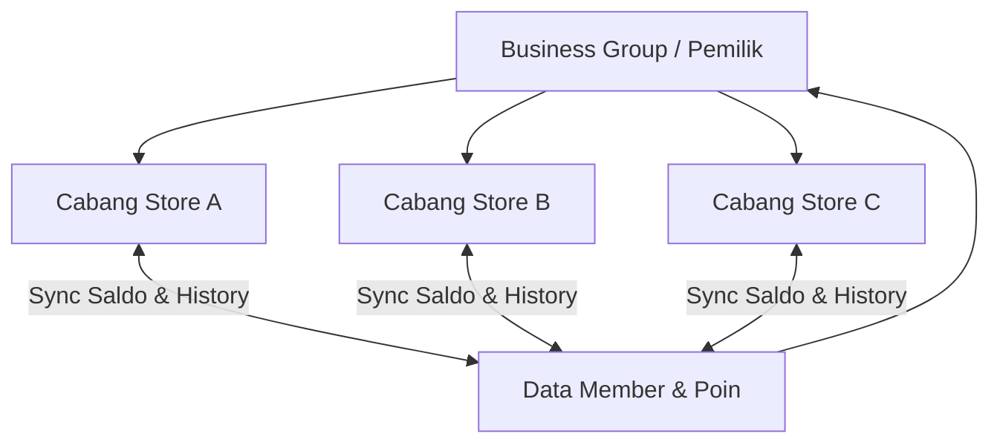

# Product Requirement Document (PRD)
## Fitur: Customer Loyalty Points & Member History (Multi-Branch)

---

## 1. Pendahuluan & Latar Belakang
Dalam bisnis retail dan F&B, retensi pelanggan sangat bergantung pada program loyalitas. Fitur **Customer Loyalty Points** dirancang agar pemilik toko (*Store Owner*) dapat memberikan apresiasi kepada pelanggan setia (*Member*) dalam bentuk poin yang dapat dikumpulkan dari setiap transaksi dan ditukarkan di kemudian hari. 

Fitur ini harus mendukung struktur bisnis **Multi-Cabang (Multi-Branch)**, di mana poin yang dikumpulkan di Cabang A dapat digunakan atau ditukarkan di Cabang B selama cabang-cabang tersebut berada di bawah entitas bisnis/mercant yang sama.

---

## 2. Fitur Utama (Core Features)
1. **Sistem Keanggotaan Terpusat (Centralized Member Database)**:
   - Pelanggan terdaftar sebagai member di bawah entitas bisnis utama (*Merchant/Group*), bukan cabang tunggal.
2. **Pengaturan Poin Fleksibel (Flexible Point Configuration)**:
   - Pengaturan rasio poin default berdasarkan nominal belanja transaksi.
   - Pengaturan poin khusus (*Custom Product Points*) per produk atau varian produk.
3. **Riwayat Mutasi Poin (Point Mutation History)**:
   - Pencatatan mendetail untuk setiap poin yang masuk (*Earned*) atau keluar (*Redeemed*), lengkap dengan cabang asal transaksi.
4. **Dukungan Multi-Cabang (Multi-Branch Support)**:
   - Integrasi saldo poin secara real-time antar cabang di bawah satu pemilik bisnis yang sama.
5. **Penukaran Poin (Point Redemption)**:
   - Poin dapat digunakan sebagai pemotong tagihan (*diskon nominal*) atau ditukarkan dengan produk gratis (*voucher reward*).

---

## 3. Mekanisme Perhitungan Poin

Admin Toko (*Store Admin*) dapat memilih **Metode Perhitungan Poin** yang aktif untuk cabang tokonya melalui Panel Pengaturan Toko. Sistem menyediakan 3 pilihan metode:

### Metode 1: Nominal Transaksi (Transaction-based Points)
Poin dihitung murni dari total belanja pelanggan (setelah diskon, sebelum pajak) dengan kelipatan nominal tertentu yang diset oleh toko.
* **Pengaturan Toko**: 
  - Kelipatan Belanja (Threshold): Rp 10.000
  - Perolehan Poin (Value): 1 Poin
* **Rumus**:
  $$\text{Poin Diperoleh} = \lfloor \frac{\text{Total Belanja}}{\text{Kelipatan Belanja}} \rfloor \times \text{Perolehan Poin}$$
* *Contoh*: Pelanggan belanja sebesar Rp 45.500. Maka poin yang didapat adalah $\lfloor 45.500 / 10.000 \rfloor \times 1 = 4\text{ Poin}$.

### Metode 2: Berdasarkan Produk (Product-Specific Points)
Poin diperoleh berdasarkan jumlah item produk yang dibeli. Setiap produk/varian yang memiliki nilai poin custom akan berkontribusi terhadap total poin. Produk yang tidak di-set nilai poinnya tidak akan memberikan poin sama sekali.
* **Pengaturan Produk**:
  - Nasi Goreng Spesial: 5 Poin
  - Es Teh Manis: 1 Poin
  - Kerupuk (tidak di-set): 0 Poin
* **Rumus**:
  $$\text{Poin Diperoleh} = \sum (\text{Poin Produk}_i \times \text{Qty}_i)$$
* *Contoh*: Pelanggan membeli 2 Nasi Goreng Spesial (2 x 5 = 10 Poin), 1 Es Teh Manis (1 x 1 = 1 Poin), dan 3 Kerupuk (3 x 0 = 0 Poin). Total poin diperoleh adalah 11 Poin.

### Metode 3: Hybrid (Gabungan - Nominal Transaksi & Produk)
Merupakan metode gabungan antara Metode 1 dan Metode 2. 
- Produk yang memiliki pengaturan poin khusus (Metode 2) akan dihitung secara spesifik menggunakan poin produknya.
- Sisa nominal belanja dari produk biasa (yang tidak memiliki pengaturan poin khusus) akan dihitung menggunakan rasio nominal belanja (Metode 1).
* **Rumus**:
  $$\text{Poin Diperoleh} = \left( \sum \text{Poin Produk}_i \times \text{Qty}_i \right) + \lfloor \frac{\text{Total Belanja Produk Biasa}}{\text{Kelipatan Belanja}} \rfloor \times \text{Perolehan Poin}$$
* *Contoh*: 
  - Pengaturan Toko: Kelipatan Belanja Rp 10.000 dapat 1 Poin.
  - Pengaturan Produk: Nasi Goreng Spesial = 5 Poin. Es Teh Manis tidak di-set (produk biasa).
  - Belanjaan: 1 Nasi Goreng Spesial (Rp 25.000) dan 2 Es Teh Manis (2 x Rp 8.000 = Rp 16.000).
  - Kalkulasi Poin:
    - Poin dari produk khusus (Nasi Goreng): 1 x 5 = 5 Poin.
    - Total Belanja Produk Biasa (Es Teh Manis): Rp 16.000.
    - Poin dari produk biasa: $\lfloor 16.000 / 10.000 \rfloor \times 1 = 1\text{ Poin}$.
    - Total Poin Diperoleh: 5 Poin + 1 Poin = 6 Poin.

---

## 4. Mekanisme Multi-Cabang (Multi-Branch Mechanics)

Agar poin dapat berlaku lintas cabang, RimsPos akan menerapkan hirarki **Business/Merchant Group**:



### Aturan Multi-Cabang:
1. **Kepemilikan Member**: Member terdaftar di bawah `business_id` (entitas bisnis utama yang memiliki banyak cabang `store_id`).
2. **Real-time Balance**: Saldo poin disimpan di tabel `members` terpusat. Setiap kali Cabang A memperbarui poin member, saldo terbaru langsung ter-update di server dan dapat diakses seketika oleh kasir di Cabang B.
3. **Pencatatan Cabang**: Setiap mutasi poin wajib mencatat `store_id` asal terjadinya transaksi untuk kebutuhan audit dan pembagian bagi hasil antar cabang.

---

## 5. Rancangan Database (Database Schema)

Berikut adalah tabel-tabel baru dan modifikasi kolom yang diperlukan:

### 1. Modifikasi Tabel `stores`
Menambahkan penanda kepemilikan grup bisnis agar cabang-cabang dapat saling terhubung.
```sql
ALTER TABLE stores ADD COLUMN business_id INT NULL AFTER id;
```

### 2. Tabel `members`
Menyimpan profil member, saldo poin aktif, dan grup bisnis asalnya.
```sql
CREATE TABLE members (
    id BIGINT UNSIGNED AUTO_INCREMENT PRIMARY KEY,
    business_id INT NOT NULL,                  -- Terikat ke grup bisnis/merchant
    name VARCHAR(100) NOT NULL,
    phone VARCHAR(20) NOT NULL,
    email VARCHAR(100) NULL,
    total_points INT DEFAULT 0,                 -- Saldo poin aktif saat ini
    is_active BOOLEAN DEFAULT TRUE,
    created_at TIMESTAMP,
    updated_at TIMESTAMP,
    UNIQUE(business_id, phone)                  -- Phone unik per grup bisnis
);
```

### 3. Modifikasi Tabel `products` atau `product_variants`
Menambahkan kolom point untuk pengaturan poin per item produk.
```sql
ALTER TABLE product_variants ADD COLUMN reward_points INT DEFAULT 0 AFTER price;
```

### 4. Tabel `member_point_histories` (Riwayat Poin)
Mencatat detail mutasi penambahan atau pengurangan poin.
```sql
CREATE TABLE member_point_histories (
    id BIGINT UNSIGNED AUTO_INCREMENT PRIMARY KEY,
    member_id BIGINT UNSIGNED NOT NULL,
    store_id INT NOT NULL,                     -- Lokasi cabang terjadinya transaksi
    sale_id BIGINT UNSIGNED NULL,              -- Referensi transaksi penjualan (jika ada)
    mutation_type ENUM('earn', 'redeem', 'adjust', 'expire') NOT NULL,
    points INT NOT NULL,                       -- Nilai mutasi (+poin atau -poin)
    balance_after INT NOT NULL,                -- Saldo poin akhir setelah mutasi
    notes VARCHAR(255) NULL,                   -- Keterangan (e.g. "Belanja POS-123", "Penukaran Kopi")
    created_at TIMESTAMP,
    FOREIGN KEY (member_id) REFERENCES members(id) ON DELETE CASCADE
);
```

---

## 6. Alur Kerja Pengguna (User Flow)

### A. Alur Kasir di POS (Perolehan Poin)
1. Pelanggan datang ke meja kasir (atau memesan lewat Self-Service).
2. Kasir memilih menu atau melakukan scan barang.
3. Sebelum pembayaran, kasir memasukkan nomor handphone pelanggan untuk mencari data member:
   - Jika member ditemukan, tampilkan Nama Member dan Saldo Poin saat ini.
   - Jika belum terdaftar, kasir dapat mendaftarkan member baru langsung dari aplikasi POS.
4. Kasir menyelesaikan pembayaran.
5. Sistem menghitung poin yang diperoleh dari transaksi tersebut berdasarkan metode kalkulasi yang aktif di toko.
6. Sistem menambahkan poin ke saldo member dan mencatat riwayat mutasi baru ke tabel `member_point_histories` dengan label cabang (`store_id`) saat itu.

### B. Alur Kasir di POS (Penukaran Poin)
1. Pelanggan ingin membayar menggunakan poinnya sebagai potongan diskon.
2. Kasir memanggil data member di layar transaksi POS.
3. Kasir menginput jumlah poin yang ingin ditukarkan (misal: 50 poin = Diskon Rp 5.000).
4. Sistem memverifikasi saldo poin member mencukupi.
5. Poin dikurangi dari saldo member aktif, mencatat mutasi jenis `'redeem'` di database.
6. Transaksi POS selesai dengan potongan diskon dari penukaran poin tersebut.

---

## 7. Aturan Khusus & Penanganan Kasus Ekstrem (Edge Cases)
1. **Transaksi Void / Refund**:
   - Jika transaksi penjualan dibatalkan (*void*), poin yang diperoleh dari transaksi tersebut harus ditarik kembali dari saldo member secara otomatis.
   - Jika saldo member menjadi negatif akibat penarikan poin pasca belanja, sistem akan mencatat saldo negatif tersebut dan memotongnya saat transaksi berikutnya.
2. **Kedaluwarsa Poin (Point Expiration)**:
   - Toko dapat mengatur masa berlaku poin (misal: poin hangus setiap tanggal 31 Desember tahun berjalan atau setelah 12 bulan dari tanggal perolehan).
   - Cron job terjadwal berjalan setiap malam untuk memeriksa poin kadaluwarsa dan memotong saldo member.
3. **Koneksi Offline**:
   - Karena poin berlaku multi-cabang, pencarian dan pemotongan poin membutuhkan koneksi internet aktif ke server pusat database RimsPos. Jika sistem POS sedang berjalan dalam mode offline lokal, penukaran poin tidak diperbolehkan demi menghindari pemakaian poin ganda (*double spending*). Namun, perolehan poin belanja offline dapat di-queue dan di-sync setelah POS kembali online.
