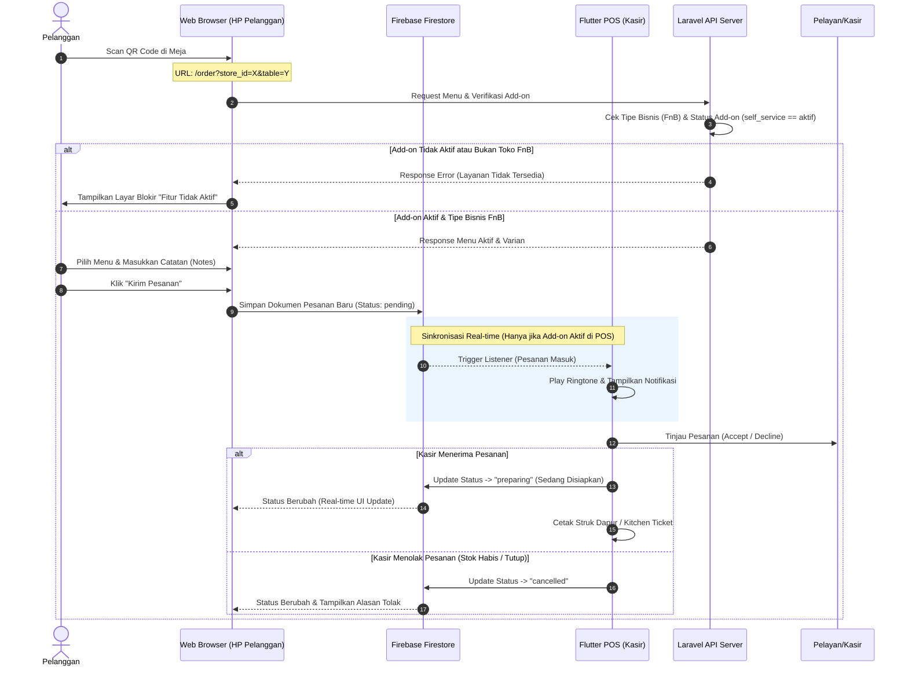
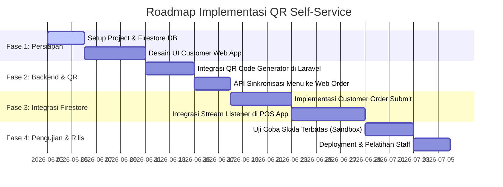

# Product Requirement Document (PRD)
## Fitur: Customer Self-Service (QR Order) dengan Real-time Firestore Sync

| Detail | Deskripsi |
| :--- | :--- |
| **Proyek** | RIMS POS - FnB Customer Self-Service |
| **Status** | Proposed |
| **Penulis** | Antigravity AI |
| **Target Rilis** | Q3 2026 |
| **Teknologi Utama** | Flutter Web (Customer Portal) atau Laravel Blade SPA, Cloud Firestore (Real-time DB), Flutter Mobile (Cashier POS) |
| **Jenis Fitur** | Add-on Premium (Hanya untuk Tipe Bisnis FnB) |
| **Konfigurasi** | Diatur & diaktifkan oleh Superadmin per Toko |

---

## 1. Latar Belakang & Tujuan
Pada bisnis Food & Beverage (FnB), kecepatan dan akurasi pencatatan pesanan sangat krusial. Sistem konvensional mengharuskan pelayan mendatangi meja untuk mencatat pesanan secara manual atau pelanggan mengantre di kasir. 

**Fitur Customer Self-Service (QR Order)** memungkinkan pelanggan untuk langsung memesan menu melalui smartphone mereka sendiri dengan memindai kode QR yang ditempel di meja masing-masing. Integrasi **Cloud Firestore** memastikan setiap pesanan masuk secara real-time ke aplikasi kasir (POS Mobile), meminimalisir delay dan meningkatkan efisiensi operasional.

---

## 2. Alur Pengguna (User Flows)



### A. Alur Pelanggan (Customer Journey)
1. **Scanning & Landing:** Pelanggan memindai QR code di meja (misal: Meja 05). Browser membuka URL web order.
2. **Identifikasi:** Pelanggan memasukkan nama mereka (misal: "Budi") untuk memulai sesi pesanan.
3. **Pemesanan:** Pelanggan menjelajahi menu, memilih varian/opsi makanan, menambahkan catatan (misal: "Pedas sekali", "Tanpa es"), lalu memasukkannya ke keranjang belanja.
4. **Checkout:** Pelanggan meninjau keranjang belanja dan menekan tombol **"Kirim Pesanan"**.
5. **Monitoring Real-time:** Setelah terkirim, pelanggan dialihkan ke halaman status pesanan yang menampilkan status terkini secara real-time:
   * ⏳ *Menunggu Konfirmasi Kasir*
   * 🍳 *Sedang Disiapkan di Dapur*
   * 🛵 *Pesanan Disajikan*
   * ❌ *Pesanan Ditolak* (jika dibatalkan oleh kasir)

### B. Alur Kasir / Pelayan (Cashier POS Journey)
1. **Live Listening:** Aplikasi kasir Flutter secara aktif mendengarkan (*listen*) perubahan pada Firestore koleksi `self_service_orders`.
2. **Notifikasi Masuk:** Saat ada dokumen baru dengan status `pending`, aplikasi berbunyi (ping/ringtone) dan memunculkan badge angka pada tab **"Pesanan Mandiri"**.
3. **Review & Konfirmasi:** Kasir membuka tab tersebut, meninjau detail pesanan dari meja terkait.
   * **Terima:** Kasir menekan "Terima". POS secara otomatis membuat transaksi aktif (hold/bill) di sistem, mengirim perintah cetak ke printer dapur, dan memperbarui status Firestore menjadi `preparing`.
   * **Tolak:** Kasir menekan "Tolak" (opsional memasukkan alasan, misal: "Bahan habis") dan memperbarui status Firestore menjadi `cancelled`.
4. **Penyelesaian Transaksi:** Ketika pelanggan selesai makan dan ingin membayar, kasir memanggil pesanan dari daftar bill aktif, memproses pembayaran (tunai/Qris/debit), lalu mencetak struk final. Status di Firestore berubah menjadi `completed` atau `served`.

---

## 3. Spesifikasi Fungsional

### F-01: Generator QR Code Meja (Admin/Owner Panel)
* **Deskripsi:** Sistem dapat memproduksi QR Code unik untuk setiap meja terdaftar secara dinamis.
* **Format URL QR:** `https://pos.rimsdev.com/order?store_id={store_id}&table={table_name}&hash={signature}`
  > [!NOTE]
  > Parameter `hash` atau `signature` opsional digunakan untuk validasi keamanan agar mencegah pelanggan menembak pesanan ke meja lain secara sembarangan dari luar restoran.

### F-02: Web App Pemesanan Pelanggan (Customer Web Portal)
* **Deskripsi:** Aplikasi berbasis web (responsif mobile) yang ringan, cepat, dan tidak memerlukan instalasi.
* **Fitur Utama:**
  * Sinkronisasi kategori dan menu aktif langsung dari API database utama Laravel.
  * Proteksi pemesanan berdasarkan status operasional toko (buka/tutup).
  * Fitur pencarian menu dan filter kategori yang responsif.
  * Input detail item (jumlah, varian produk, catatan khusus).

### F-03: Integrasi Firestore Real-time Sync
* **Deskripsi:** Jembatan komunikasi instan antara Web Browser pelanggan dan Flutter Mobile POS kasir.
* **Alur Firestore:**
  * Penulisan order baru oleh pelanggan langsung dimasukkan ke database Firestore.
  * Kasir menggunakan `StreamBuilder` atau snapshot listener pada SDK Firestore Flutter untuk melacak perubahan secara instan tanpa perlu membebani REST API Laravel dengan polling berulang.

### F-04: Panel Konfirmasi POS Kasir (Flutter App)
* **Deskripsi:** Modul/Halaman khusus di aplikasi kasir untuk mengelola pesanan masuk mandiri.
* **Fitur Utama:**
  * List pesanan masuk berdasarkan urutan waktu (FIFO).
  * Indikator visual meja dan nama pemesan.
  * Tombol aksi cepat: **Terima Pesanan** dan **Tolak Pesanan**.
  * Auto-print ke printer thermal dapur sesaat setelah pesanan dikonfirmasi.

### F-05: Proteksi & Pembatasan Add-on (Superadmin Control)
* **Deskripsi:** Membatasi akses fitur Customer Self-Service (QR Order) berdasarkan status addon toko yang dikonfigurasi oleh Superadmin.
* **Fitur Utama:**
  * **Pencegahan Akses Web Portal:** Ketika memuat halaman `/order`, API Laravel backend melakukan verifikasi apakah `store_id` tersebut bertipe bisnis `fnb` dan memiliki status addon `self_service = true`. Jika tidak valid, kembalikan response HTTP 403 Forbidden dengan halaman antarmuka "Layanan Self-Service Dinonaktifkan".
  * **Penyembunyian UI di POS App:** Aplikasi Flutter POS akan menerima konfigurasi addon saat inisialisasi session toko. Jika `has_self_service` bernilai `false`, maka:
    * Sembunyikan tab "Pesanan Mandiri" dari dashboard kasir.
    * Jangan mengaktifkan Firestore Snapshot Listener untuk koleksi `self_service_orders` guna menghemat kuota pembacaan Firestore.
    * Sembunyikan opsi QR Code Generator di Admin Panel toko.

---

## 4. Struktur Database Firestore (Schema Design)

Berikut adalah rancangan dokumen NoSQL Firestore untuk sinkronisasi real-time:

### Koleksi Utama: `stores`
Koleksi root untuk memisahkan data antar cabang/toko dan menyimpan status addon.

```json
stores (Collection)
  └── {store_id} (Document)
        ├── id: 10
        ├── name: "Kopi Kenangan - Cabang Depok"
        ├── business_type: "fnb"
        ├── addon_self_service: true  // Flag status addon
        ├── addon_kds: true          // Flag status addon KDS
        └── self_service_orders (Sub-Collection)
              └── {order_id} (Document)
                    ├── id: "order_1717336123456"
                    ├── table_number: "Meja 05"
                    ├── customer_name: "Rian"
                    ├── status: "pending"  // ["pending", "preparing", "served", "cancelled", "completed"]
                    ├── status_reason: ""  // Alasan jika ditolak
                    ├── items: [
                    │     {
                    │       "product_variant_id": 42,
                    │       "name": "Nasi Goreng Spesial",
                    │       "qty": 2,
                    │       "price": 25000,
                    │       "notes": "Pedas sedang, telur dadar"
                    │     },
                    │     {
                    │       "product_variant_id": 105,
                    │       "name": "Es Teh Manis",
                    │       "qty": 2,
                    │       "price": 5000,
                    │       "notes": "Manis biasa"
                    │     }
                    │   ]
                    ├── subtotal: 60000
                    ├── discount: 0
                    ├── total: 60000
                    ├── created_at: Timestamp(June 2, 2026 at 8:15:00 PM UTC+7)
                    └── updated_at: Timestamp(June 2, 2026 at 8:15:00 PM UTC+7)
```

---

## 5. Keamanan & Aturan Validasi (Firestore Security Rules)
Untuk menghindari manipulasi pesanan oleh pihak luar, aturan akses Firestore (*Firestore Security Rules*) harus diterapkan secara ketat. Aturan ini juga memvalidasi apakah addon `self_service` aktif pada dokumen toko (`stores/{storeId}`) sebelum pelanggan diizinkan menulis pesanan baru:

```javascript
rules_version = '2';
service cloud.firestore {
  match /databases/{database}/documents {
    match /stores/{storeId} {
      // Izinkan pembacaan data store untuk mengecek status addon
      allow read: if true;
      
      match /self_service_orders/{orderId} {
        // Pelanggan bisa membuat pesanan (create) jika addon_self_service bernilai true
        allow create: if request.resource.data.status == 'pending'
                      && get(/databases/$(database)/documents/stores/$(storeId)).data.addon_self_service == true;
        
        allow read: if true; // Bisa dibatasi dengan session cookie / token jika dibutuhkan
        
        // Pelanggan hanya bisa update statusnya sendiri ke 'cancelled' jika kasir belum memproses ('pending')
        allow update: if request.resource.data.status == 'cancelled' 
                      && resource.data.status == 'pending'
                      && get(/databases/$(database)/documents/stores/$(storeId)).data.addon_self_service == true;
        
        // Kasir (Authenticated Staff) memiliki akses penuh (write/update)
        // Identifikasi kasir didapatkan dari Firebase Auth Custom Claims
        allow update, delete: if request.auth != null && request.auth.token.store_id == storeId;
      }
    }
  }
}
```

---

## 6. Rencana Implementasi & Milestone



---

## 7. Penanganan Kasus Khusus (Edge Cases & Fallback)

1. **Jaringan Internet Pelanggan Terputus Saat Memesan**
   * *Solusi:* Web App menggunakan local storage untuk menyimpan draf keranjang belanja. Sistem akan mencoba melakukan re-koneksi otomatis (*auto-retry*) dan menampilkan pesan pemberitahuan yang ramah pengguna jika koneksi internet terputus.
2. **Koneksi Firestore Kasir Mengalami Gangguan**
   * *Solusi:* Aplikasi POS Kasir akan mendeteksi status konektivitas Firestore. Jika offline lebih dari 30 detik, POS akan memunculkan banner peringatan `"Koneksi Real-time Terputus - Mengalihkan ke Backup Polling Laravel"`, dan sistem akan melakukan fallback menggunakan REST API long-polling setiap 15 detik ke Laravel Backend.
3. **Meja yang Sama Mengirim Dua Pesanan Bersamaan**
   * *Solusi:* Firestore akan menumpuk pesanan sebagai dokumen baru dengan ID berbeda. Kasir akan melihat kedua pesanan tersebut secara terpisah di antrean dan dapat melakukan *merge* (penggabungan bill) saat pesanan dikonfirmasi ke meja terkait.
