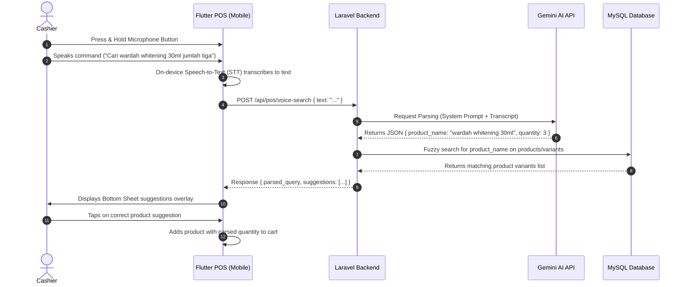

# Product Requirements Document (PRD) - Voice Command Product Search with Gemini AI

This document outlines the product requirements, system architecture, API specifications, and UX flows for introducing voice-command-based product search in the RimsPOS Mobile app.

---

## 1. Overview & Goal

The objective is to allow cashiers to quickly search for products and specify quantities hands-free during checkout using voice commands.
- **Example Command**: *"Cari wardah whitening 30ml jumlah tiga"*
- **Target Outcome**: The POS app transcribes the audio, parses the product name (*"wardah whitening 30ml"*) and quantity (*"3"*), queries the database, and presents matching suggestions directly to the cashier for quick addition to the cart.

---

## 2. System Architecture & Sequence

Below is the workflow showing how the Flutter mobile app, Laravel backend, Gemini AI, and the local database interact:



---

## 3. Tech Stack & Dependencies

### A. Mobile (Flutter)
- **Speech-to-Text Package**: [`speech_to_text`](https://pub.dev/packages/speech_to_text)
  - *Why*: Free, uses on-device native speech recognition (iOS SFSpeechRecognizer & Android SpeechRecognizer), works offline/online, low latency.
- **UI Animations**: [`avatar_glow`](https://pub.dev/packages/avatar_glow) or custom Flutter `AnimationController` for showing listening mic ripple effects.

### B. Backend (Laravel)
- **HTTP Client**: Built-in Laravel `Http` facade.
- **Gemini SDK** (Optional): [`google-gemini-php/client`](https://github.com/google-gemini-php/client) or direct REST API requests.

---

## 4. API Specification

### Endpoint: Voice Search & Recommend
- **URL**: `POST /api/pos/voice-search`
- **Headers**: 
  - `Content-Type: application/json`
  - `Authorization: Bearer <token>`
- **Request Body**:
```json
{
  "text": "cari wardah whitening 30ml jumlah tiga"
}
```

- **Response Body (Success)**:
```json
{
  "success": true,
  "parsed_query": {
    "product_name": "wardah whitening 30ml",
    "quantity": 3
  },
  "suggestions": [
    {
      "id": 102,
      "variant_id": 61,
      "product_name": "Wardah Lightening Day Cream",
      "variant_name": "30ml",
      "sku": "WRD-LGT-030",
      "barcode": "8991234567812",
      "harga_jual": 45000,
      "stok_store": 15,
      "image_url": "https://rimspos.com/storage/products/wardah.png"
    },
    {
      "id": 103,
      "variant_id": 62,
      "product_name": "Wardah Lightening Night Cream",
      "variant_name": "30ml",
      "sku": "WRD-LGT-N-030",
      "barcode": "8991234567813",
      "harga_jual": 48000,
      "stok_store": 8,
      "image_url": "https://rimspos.com/storage/products/wardah-night.png"
    }
  ]
}
```

---

## 5. Gemini AI Prompt Design

Laravel will instruct Gemini to parse the user's spoken command into clean JSON using the **Gemini 1.5 Flash** model.

### System Prompt & Constraints
```text
You are a voice command parser for a retail POS system. Your task is to analyze the cashier's transcript and extract:
1. "product_name": The product description or brand (string).
2. "quantity": The requested quantity. Default to 1 if not specified (integer).

Input: "cari wardah whitening 30ml jumlah tiga"
Output JSON: { "product_name": "wardah whitening 30ml", "quantity": 3 }

Input: "wardah whitening"
Output JSON: { "product_name": "wardah whitening", "quantity": 1 }

Constraints:
- You must ONLY return a valid JSON object.
- Do not output any markdown formatting (like ```json), commentary, or extra text.
```

> [!TIP]
> Use Gemini's **Structured Output (JSON Schema)** feature to enforce that the response strictly conforms to the `{ "product_name": string, "quantity": integer }` format without needing regex cleanups.

---

## 6. Laravel DB Query Design

Once the product name is parsed, the backend should search for matches across:
1. Product Name (`nama_produk`)
2. SKU (`sku`)
3. Barcodes (`barcode`)
4. Variant Label / Attributes (`variant_name` or attribute values like `nama`)

### Proposed Search Logic
```php
$searchTerm = $parsedQuery['product_name'];

$suggestions = ProductVariant::with(['product', 'barcodeActive'])
    ->where('is_active', 'Y')
    ->where(function($query) use ($searchTerm) {
        $query->where('sku', 'like', "%{$searchTerm}%")
            ->orWhere('variant_name', 'like', "%{$searchTerm}%")
            ->orWhereHas('product', function($q) use ($searchTerm) {
                $q->where('nama_produk', 'like', "%{$searchTerm}%");
            })
            ->orWhereHas('barcodes', function($q) use ($searchTerm) {
                $q->where('barcode', 'like', "%{$searchTerm}%");
            });
    })
    ->limit(10)
    ->get();
```

---

## 7. Flutter UI/UX Recommendations

To make the voice search feel premium, the app should incorporate modern UI patterns:

### A. Mic Trigger Button
- Place a floating mic icon next to the standard search bar.
- **Micro-Animation**: When tapped or held, show a pulsing glow ring (ripple) indicating the mic is active and listening.

### B. Suggestion bottom sheet
- When the API returns the suggestion list, slide up a bottom sheet overlay:
  - Header: *"Hasil Pencarian Voice (Kuantitas: 3)"*
  - Body: A vertical list of product suggestion cards showing the product name, variant, price, and current stock.
  - Action: Cashier taps the matching card to automatically append it to the active cart with `quantity = 3` and close the sheet.
  - If no products match, display a clean "Product not found" state with a manual search backup.

---

## 8. Implementation Phases

| Phase | Description | Key Deliverables |
| :--- | :--- | :--- |
| **Phase 1: STT** | Implement native speech-to-text in Flutter | Mic button, listening animations, text transcription state. |
| **Phase 2: Backend** | Create Laravel endpoints and Gemini service integration | Gemini client, structured prompt, parsing API. |
| **Phase 3: DB Search** | Implement robust database search queries | SQL query matching SKU/brand/attributes, pagination/limits. |
| **Phase 4: POS UI** | Build suggestions UI overlay in Flutter | Bottom Sheet suggestions list, add-to-cart callback logic. |
