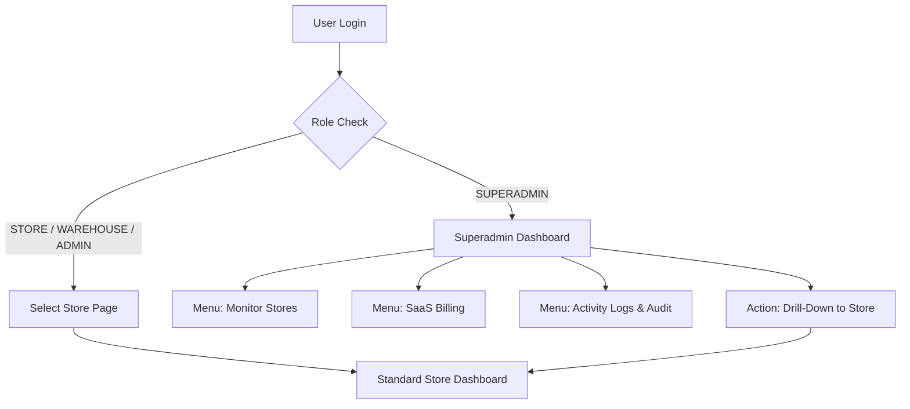

# Product Requirement Document (PRD): Menu & Dashboard SUPERADMIN

Dokumen ini mendefinisikan kebutuhan fungsional dan teknis untuk menu **SUPERADMIN**, termasuk pemisahan dashboard (dashboard khusus Superadmin) untuk memantau performa, aktivitas, transaksi, stok, dan tagihan seluruh toko (multi-store monitoring).

---

## 1. Pendahuluan & Latar Belakang

Sistem POS RimsPOS saat ini telah mendukung multi-tenant/multi-store dengan kolom `store_id` pada berbagai entitas data utama. Namun, saat ini dashboard beranda masih disatukan dan difilter per toko berdasarkan `session('store_id')`. 

Untuk level manajemen (Superadmin), dibutuhkan kemampuan pengawasan tingkat tinggi (*high-level oversight*) tanpa harus masuk atau berganti sesi toko satu per satu. Dengan menu dan dashboard khusus Superadmin, pengguna dengan peran Superadmin dapat langsung melihat agregasi performa bisnis secara keseluruhan, memantau aktivitas transaksi terbaru dari semua toko, dan mendeteksi masalah operasional (seperti stok kritis) secara real-time.

---

## 2. Tujuan Fitur

1. **Dashboard Agregat Terpisah**: Menyediakan antarmuka beranda khusus bagi Superadmin saat login, yang menampilkan metrik finansial dan operasional gabungan seluruh toko.
2. **Monitoring Toko Aktif**: Memantau kesehatan bisnis setiap toko (toko teraktif, performa penjualan, status langganan/SaaS Billing).
3. **Feed Aktivitas Real-Time**: Menyediakan log transaksi penjualan terbaru, transfer stok, pengeluaran biaya operasional, dan aktivitas audit harian dari seluruh toko.
4. **Fungsi Impersonasi / Drill-Down**: Mengizinkan Superadmin untuk "melihat detail" salah satu toko, memfilter data dashboard khusus untuk toko tersebut, atau beralih ke dashboard internal toko terkait.

---

## 3. Arsitektur Alur Dashboard & Menu

Berikut adalah visualisasi alur akses pengguna setelah proses autentikasi (login) berhasil:



---

## 4. Perbandingan Fungsionalitas Dashboard

Untuk memperjelas perbedaan antara dashboard standar toko dengan dashboard khusus Superadmin:

| Fitur / Informasi | Dashboard Standar Toko | Dashboard Khusus Superadmin |
| :--- | :--- | :--- |
| **Cakupan Data** | Terbatas pada `session('store_id')` yang aktif. | Seluruh toko (agregasi global) & pembanding antar toko. |
| **Metrik Utama (KPI)** | - Total produk aktif di toko.<br>- Stok di gudang vs toko.<br>- Penjualan toko hari & bulan ini.<br>- Tren penjualan toko 30 hari. | - Total Toko Aktif vs Non-aktif.<br>- Total Omzet Penjualan Global (Hari/Bulan ini).<br>- Total Pengeluaran Operasional Global.<br>- Jumlah Pelanggan & User Aktif di seluruh sistem. |
| **Visualisasi Tren** | Line chart tren penjualan harian toko bersangkutan. | - Multi-line chart tren omzet per toko.<br>- Bar chart perbandingan omzet antar toko.<br>- Pie chart metode pembayaran global. |
| **Log Aktivitas** | Riwayat transaksi lokal toko. | Live feed aktivitas global (Contoh: *"Store A baru saja melakukan closing POS Rp1.2M"*). |
| **Manajemen Kontrol** | Pengaturan internal toko. | - Manajemen Store (Create/Edit/Disable/Soft-Delete).<br>- SaaS Billing (Invoice, Status Berlangganan). |

---

## 5. Kebutuhan Fungsional & Spesifikasi Menu

### 5.1. Dashboard Superadmin (Beranda Utama)
*   **Widget Ringkasan Global (Top Metric Cards)**:
    *   **Total Toko**: Menampilkan jumlah toko terdaftar (Aktif/Masa Percobaan/Expired/Non-aktif).
    *   **Penjualan Hari Ini (Global)**: Jumlah transaksi dan total nominal rupiah penjualan hari ini dari seluruh toko terintegrasi.
    *   **Penjualan Bulan Ini (Global)**: Total akumulasi penjualan dari tanggal 1 bulan berjalan.
    *   **Operasional Expense (Global)**: Total pengeluaran operasional seluruh toko bulan ini.
*   **Performa Toko (Top Stores Table)**:
    *   Tabel peringkat toko berdasarkan omzet tertinggi dalam periode bulan berjalan.
    *   Kolom: Nama Toko, Jumlah Transaksi, Total Penjualan, Rata-rata Nilai Transaksi (Basket Size), Status Langganan.
*   **Live Activity Feed**:
    *   Daftar aktivitas terbaru dari semua toko (terurut berdasarkan timestamp terbaru).
    *   Jenis aktivitas yang ditampilkan:
        *   **Penjualan**: Transaksi POS baru yang diselesaikan (*paid*).
        *   **Stok**: Mutasi stok keluar-masuk besar, penyesuaian stok (*adjustment*), atau pendaftaran *stock opname* baru.
        *   **Biaya**: Pengajuan pengeluaran biaya operasional bernilai tinggi.
        *   **Sesi**: Pembukaan/penutupan kasir atau audit harian toko.

### 5.2. Menu Monitoring Toko (Store Management & Health)
*   **Daftar Toko & Status**:
    *   Halaman daftar toko yang lebih detail dengan indikator status operasional (Aktif, Maintenance, Non-Aktif).
    *   Indikator performa sinkronisasi data atau koneksi POS.
*   **Drill-Down / Impersonasi**:
    *   Tombol "Akses Toko" (*Impersonate*) pada setiap baris toko. Jika diklik, sistem akan mengeset sementara `session('store_id')` ke toko tersebut dan mengarahkan Superadmin ke antarmuka toko agar bisa melakukan pengecekan mendalam.
    *   Di bagian atas antarmuka toko akan muncul banner: `"Anda sedang mengakses toko [Nama Toko] sebagai Superadmin. [Kembali ke Superadmin Dashboard]"`.

### 5.3. Menu Laporan Konsolidasi (Consolidated Reports)
*   **Laba Rugi Gabungan**: Laporan laba rugi bulanan yang menyandingkan kolom antar toko berdampingan untuk pembandingan performa finansial langsung.
*   **Laporan Stok Kritis Global**: Daftar produk varian yang berada di bawah ambang batas stok minimum di semua toko, mempermudah manajemen pengadaan stok terpusat.

---

## 6. Kebutuhan Teknis & Perubahan Kode

Untuk menerapkan sistem ini, beberapa komponen backend Laravel perlu disesuaikan:

### 6.1. Rute & Middleware (`routes/web.php` & Middleware)
*   Membuat route dashboard khusus untuk Superadmin, contoh: `/superadmin/dashboard` yang ditangani oleh `SuperadminDashboardController`.
*   Atau secara dinamis mendeteksi peran pada route `/home`. Jika pengguna memiliki `role_type === 'SUPERADMIN'`, panggil `indexSuperadmin()` di `DashboardController` alih-alih `index()` standar.
*   *Rekomendasi*: Menggunakan `DashboardController@index` tetapi di dalamnya mendeteksi role pengguna untuk me-render view yang berbeda:
    ```php
    public function index()
    {
        $selectedRole = session('selected_role');
        $role = \App\Models\RoleMaster::find($selectedRole);

        if ($role && $role->role_type === 'SUPERADMIN') {
            return $this->indexSuperadmin();
        }

        // Logic dashboard standar toko...
    }
    ```

### 6.2. Penanganan Global Scope Tenant (`Tenant::set(...)`)
*   Saat ini middleware `EnsureStoreSelected` menginisialisasi scope database multi-tenant menggunakan `Tenant::set(session('store_id'))`.
*   Bagi Superadmin, model yang menggunakan trait Tenant Scope harus dapat mematikan filter secara otomatis (`withoutGlobalScopes()`) saat mengakses halaman dashboard global agar data dari seluruh `store_id` dapat ditarik.
*   Contoh kueri agregasi global tanpa filter store:
    ```php
    $totalSalesToday = Sale::withoutGlobalScopes()
        ->whereDate('sale_date', Carbon::today())
        ->sum('grand_total');
    ```

### 6.3. Desain Tampilan (UI/UX)
*   Dashboard Superadmin menggunakan desain modern dengan visualisasi data interaktif menggunakan library chart (seperti Chart.js atau ApexCharts).
*   Gunakan palet warna profesional (misalnya nuansa indigo/navy/slate) untuk membedakannya dengan dashboard retail standar (hijau/biru terang).
*   Layout responsif dengan grid sistem yang optimal untuk pemantauan layar tablet maupun desktop/monitor kantor.

---

## 7. Rencana Verifikasi (Testing Plan)

### Pengujian Keamanan (Role-Based Access Control)
*   [ ] Pastikan user dengan role non-Superadmin (misal: `STORE` atau `ADMIN`) yang mencoba mengakses rute Superadmin atau data global akan diarahkan ke halaman `/unauthorized`.
*   [ ] Pastikan Superadmin dapat mengakses halaman dashboard global langsung setelah login tanpa dipaksa memilih toko di halaman `/select-store`.

### Akurasi Data
*   [ ] Verifikasi bahwa nominal omzet penjualan harian pada Dashboard Superadmin bernilai sama dengan penjumlahan omzet toko A + toko B + toko C pada hari yang sama.
*   [ ] Uji filter rentang tanggal pada chart tren performa toko berjalan dengan benar secara global.

### Fitur Impersonasi
*   [ ] Verifikasi tombol impersonasi mengeset `session('store_id')` dengan benar dan mengarahkan ke dashboard toko yang bersangkutan.
*   [ ] Uji tombol "Kembali ke Superadmin" menghapus sesi impersonasi dan mengembalikan hak akses global.
